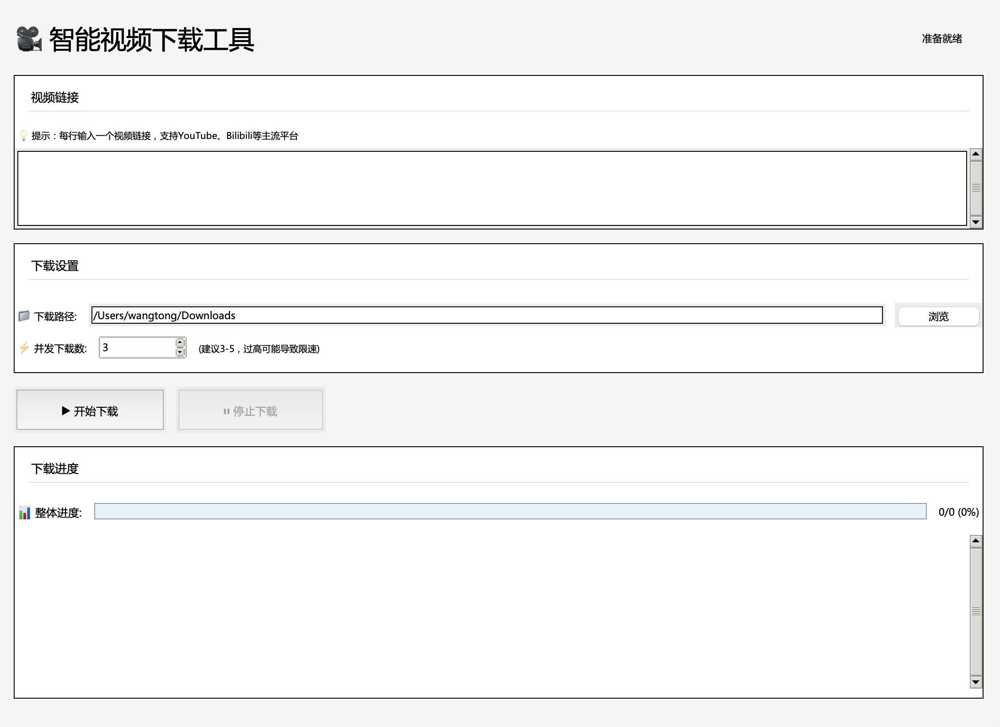
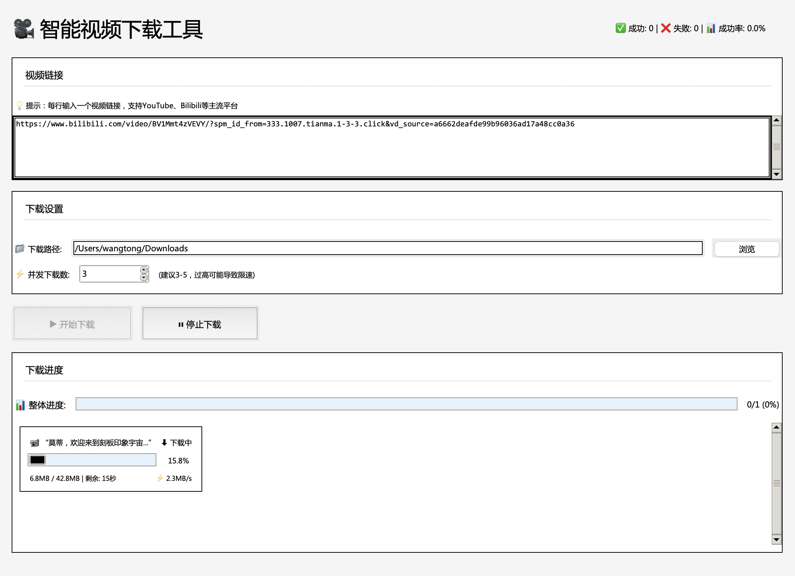

# 智能视频下载工具 V2

一个基于Python和yt-dlp的智能视频下载工具，提供友好的图形界面，支持多视频并发下载、实时进度显示和详细日志记录。

## ✨ 功能特点

### 核心功能
- 🎬 **批量下载**：支持输入多个视频链接，批量并发下载
- 🔍 **智能识别**：自动识别并支持多个主流视频平台
- 📊 **进度监控**：实时显示整体进度和每个视频的独立下载进度
- 📝 **日志记录**：详细的下载日志，包括速度、大小、剩余时间等信息
- 🛑 **中断恢复**：支持随时停止下载，避免资源浪费

### 界面特性
- 🖥️ **图形界面**：基于tkinter的现代化GUI设计
- 📁 **目录选择**：可视化选择下载目录或手动输入路径
- ⚙️ **参数调节**：支持并发数调整（1-10线程）
- 🔗 **链接管理**：自动去重、验证无效链接、支持批量粘贴

### 技术优势
- 🚀 **高性能**：多线程并发下载，充分利用带宽
- 🍎 **跨平台**：完美支持Windows、macOS（包括M系列芯片）、Linux
- 📦 **独立运行**：可打包成独立应用，无需Python环境
- 🔧 **稳定可靠**：完善的异常处理和错误提示

## 🚀 快速开始

### 方式一：直接运行Python脚本

#### 环境准备

1. **安装Python** (推荐3.10+)
   - 可以使用Anaconda或直接安装Python
   
2. **创建虚拟环境**（推荐）：

   使用conda：
   ```bash
   conda create -n video_downloader python=3.10
   conda activate video_downloader
   ```
   
   或使用venv：
   ```bash
   python -m venv venv
   source venv/bin/activate  # macOS/Linux
   # 或
   venv\Scripts\activate  # Windows
   ```

3. **安装依赖**：
   ```bash
   pip install -r requirements.txt
   ```

4. **运行程序**：
   ```bash
   python video_downloader.py
   ```

### 方式二：使用打包好的应用（推荐）

无需安装Python环境，下载后直接运行：

- **macOS**: 下载 `.app` 文件，双击运行
- **Windows**: 下载 `.exe` 文件，双击运行
- **Linux**: 下载对应版本，赋予执行权限后运行

## 📸 界面预览





## 🔨 开发者指南

### 自行打包应用

#### macOS打包

1. 给打包脚本添加执行权限：
   ```bash
   chmod +x build_app.sh
   ```

2. 运行打包脚本：
   ```bash
   ./build_app.sh
   ```

3. 打包完成后，应用程序将在 `dist/智能视频下载工具.app` 目录中

#### Windows打包

1. 运行打包脚本：
   ```bash
   build_windows.bat
   ```

2. 打包完成后，可执行文件将在 `dist/` 目录中

## 📖 使用教程

### 基本操作流程

1. **输入视频链接**
   - 在文本框中输入视频链接，每行一个
   - 支持批量粘贴多个链接
   - 程序会自动去除重复链接

2. **选择下载路径**
   - 默认路径：`~/Downloads`
   - 可点击"浏览"按钮选择目录
   - 也可以手动输入完整路径

3. **设置并发数**
   - 默认并发数：3
   - 可选范围：1-10
   - 建议根据网络带宽调整

4. **开始下载**
   - 点击"开始下载"按钮
   - 程序会验证链接有效性
   - 自动开始下载任务

5. **监控进度**
   - 顶部显示整体下载进度
   - 中间区域显示每个视频的独立进度
   - 底部日志区实时更新下载详情

6. **停止下载**
   - 可随时点击"停止下载"中断任务
   - 已完成的视频不受影响

## ⚠️ 注意事项

### 使用建议
- ✅ 确保输入有效的视频链接
- ✅ 检查磁盘空间是否充足
- ✅ 根据网络状况调整并发数
- ✅ 下载大文件时保持网络稳定

### 常见问题
- 如果下载目录不存在，程序会提示创建
- 部分视频可能需要特定cookie或认证
- 某些平台可能限制下载速度或并发数
- 遇到问题可查看日志了解详细错误信息

## 🛠️ 技术栈

| 组件 | 说明 | 版本 |
|------|------|------|
| **Python** | 主开发语言 | 3.10+ |
| **tkinter** | GUI框架 | 内置 |
| **yt-dlp** | 视频下载引擎 | 2023.12.30+ |
| **PyInstaller** | 应用打包工具 | 6.0.0+ |
| **threading** | 多线程支持 | 内置 |
| **queue** | 任务队列管理 | 内置 |

## 📂 项目结构

```
PY智能视频下载工具/
├── video_downloader.py      # 主程序文件
├── requirements.txt         # 依赖包列表
├── build_app.sh            # macOS打包脚本
├── build_windows.bat       # Windows打包脚本
├── runtime_hook.py         # 运行时钩子
├── README.md              # 项目说明文档
├── README.assets/         # README图片资源
└── dist/                  # 打包输出目录
```

## 🤝 贡献指南

欢迎提交Issue和Pull Request！

1. Fork本仓库
2. 创建特性分支 (`git checkout -b feature/AmazingFeature`)
3. 提交更改 (`git commit -m 'Add some AmazingFeature'`)
4. 推送到分支 (`git push origin feature/AmazingFeature`)
5. 提交Pull Request

## 📄 许可证

本项目仅供学习和个人使用，请遵守相关视频平台的服务条款。

## 🙏 致谢

- [yt-dlp](https://github.com/yt-dlp/yt-dlp) - 强大的视频下载引擎
- [PyInstaller](https://www.pyinstaller.org/) - Python应用打包工具
- 所有贡献者和使用者的支持

---

**免责声明**：本工具仅用于下载您有权访问的内容。请勿用于下载受版权保护的内容。使用本工具下载内容时，请确保遵守相关法律法规和平台服务条款。